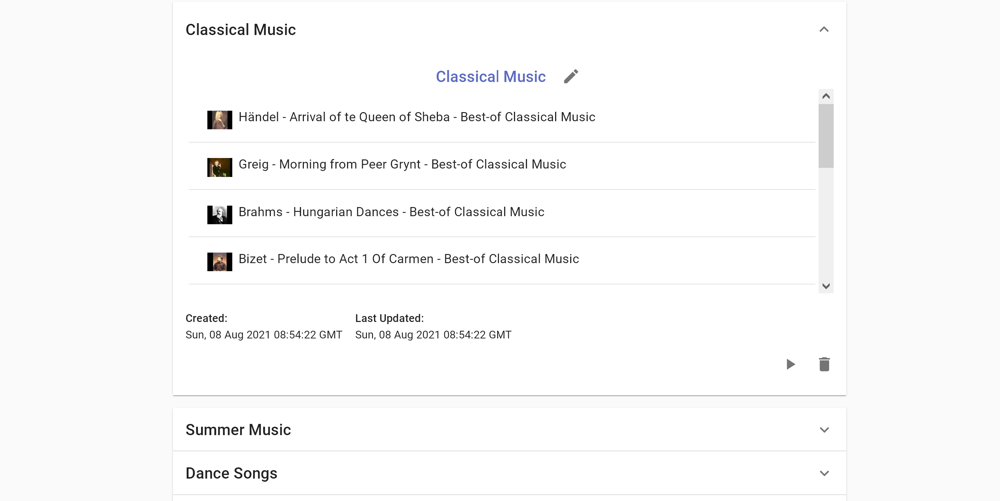

# Time Optimal Youtube Playlist Generator

Generates a custom playlist based on a user's available time and existing Youtube playlist url. Created using [React](https://reactjs.org/), [Express](https://expressjs.com/), [YouTube Data API](https://developers.google.com/youtube/v3), and [PostgreSQL](https://www.postgresql.org/).


Users can select a selection preference (ie. View count, like ratio, upload date) to tweak the outcome of the generated playlists.

Live Demo URL: https://time-optimal-youtube-playlist-generator.netlify.app/


The generated playlist can be modified and named before being saved. 


Users can save their playlists either locally or on their Google account through OAuth-based Google Sign In. 



## Running the project
Using docker:
```
$ git clone jeremysuh/time-optimal-youtube-playlist-generator
$ docker-compose up --build
```

- Fill in the enviromental variables in the docker-compose.yml file
- Rename the env.template file in both ./client and ./server to .env and fill them out accordingly

Running the front-end individiually: 
```
$ cd client
$ npm start
```

Running the back-end individiually: 
```
$ cd server
$ npx nodemon
```

